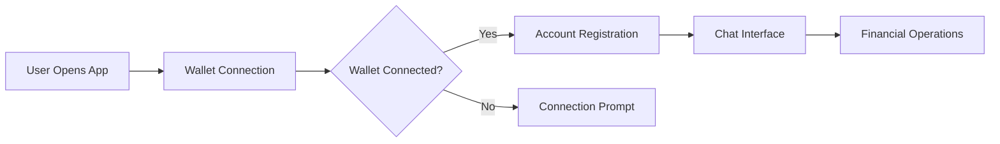

# Front-end

```
Key Architectural Principles:
1. Component-Based Design: UI broken into reusable pieces
2. Wallet-First Approach: Crypto integration from ground up
3. Decentralized Backend: Direct communication with Internet Computer
4. Responsive Design: Works across all device sizes
```

```bash
frontend/ 
├── src/ # Core application logic 
├── public/ # Static assets (images, fonts) 
├── components/ # Reusable UI components 
├── config/ # Thirdweb and environment configuration 
└── index.css # Global styling
```



#### Key Workflows:

1. **Wallet Integration**:
   * Users connect crypto wallets via Thirdweb
   * Automatic account creation on Internet Computer
   * Secure identity management
2. **Conversational Interface**:
   * Natural language financial interactions
   * AI-assisted transaction guidance
   * Real-time feedback
3. **Blockchain Operations**:
   * Secure transaction processing
   * On-chain data verification
   * Portfolio management

###

>
